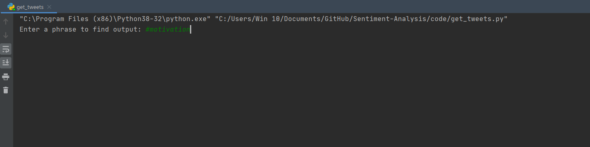
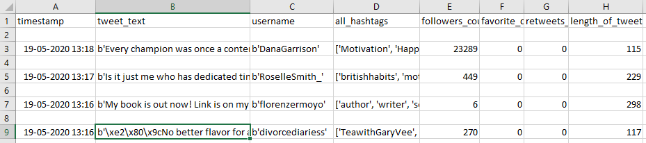
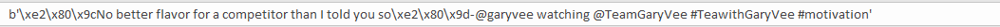
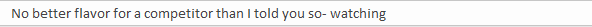
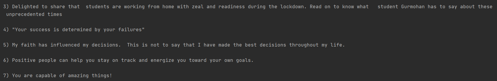
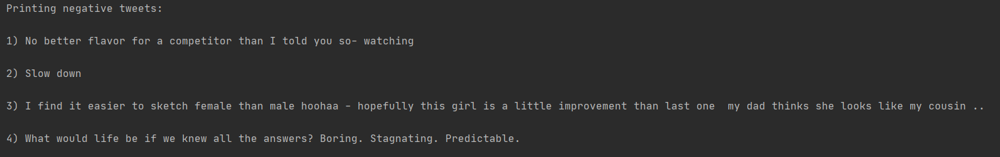
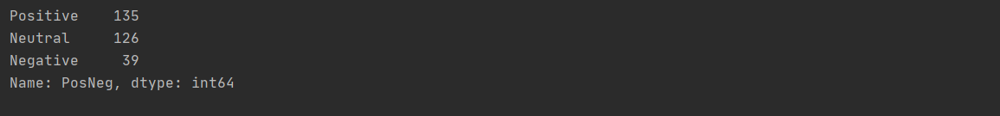
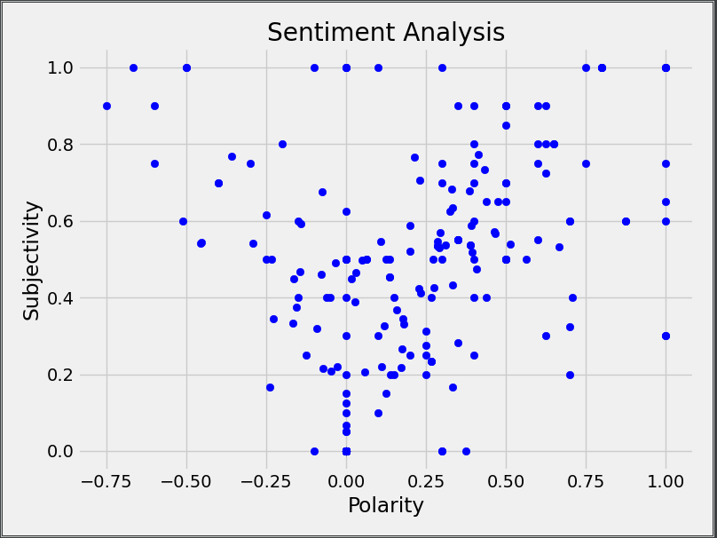
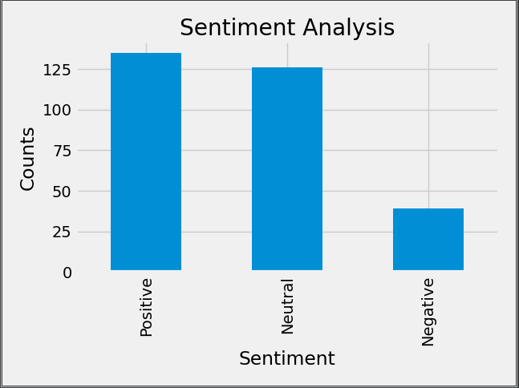

# Sentiment Analysis and Data Visualisation
 
 This repository has the code for sentiment analysis and data visualisation. This code uses Twitter API to get tweets from twitter, clean it, and then do sentiment analysis on the tweets along with some data visualisations. 

I have created two folders- one contains the code and another one conatains output csv files.

The code files includes three python files.I could've very well written all the code in a single file but I made three different files because it becomes easier to understand and work with. Also, this will help in understanding the proper pipeline to do data analysis. The three files in code directory are:-

1) get_tweets.py - This script uses Twitter API to get the tweets. You get an option to enter a keyword or hashtag for which, this script takes 300 most recent tweets and stores them in tweet_output.csv file. 

2) data_cleaning.py - This script cleans the twitter text to remove all the @username and #topics along with links to the tweet. It also removes the emojis as they cause problem in further analysis. It's output is stored in cleaned_output.csv file.

3) analysis.py - This script does the main task of doing sentiment analysis using textblob library. Along with doing sentiment analysis, it also does some visualisation and gives some output so that we can get a better idea of the data we are working with. Note that textblob can only recognize English and thus will produce inaccurate outputs when tweets contain words from other language. The final output is stored in final_output.csv file.

Let's take an example to see how it works. 

First, I run get_tweets.py then give #motivation when asked for input. Now the  tweet_output.csv file will be generated by the script. Loading 300 tweets will take some time.

This is how the output file looks like. Let's  select a single tweet to how it looks in raw format.

Notice how the emojis are also converted to ascii format. Then there are the @username and #topics which is not good for analysis so it must be cleaned.

Now run data_cleaning.py file. This will give an output file named cleaned_output.csv. Let's look at that particular tweet in the new file.

This one is better. Notice that it also removed @text so the tweet may make less sense to us. But it still has all the keywords intact. Thus it can be used for further analysis. Now finally, we run analysis.py. First of all, we get all the positive and negative tweets from the dataset. 

These are the positive tweets extracted from the dataset.

These are the few negative tweets from the data.

There is also the total number of positive, negative and neutral tweets. 

The code also outputs the scatter plot of Subjectivity to Polarity of the tweets. This is how the graph looks like.

Finally, this is a barplot showing the total number of positive, negative and neutral tweets from the given hashtag. Notice how there are more positive tweets than negative ones. This was expected from something like #motivation. This also shows us that the model is working as expected.